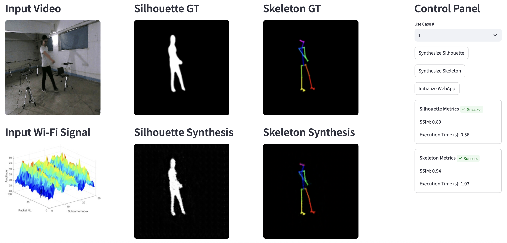

# 🛜 Human silhouette and skeleton video synthesis through Wi‑Fi signals

This repository contains a **Streamlit web application** that serves as a **demo** of the underlying neural network implementation accompanying the results of the paper:

> **Human silhouette and skeleton video synthesis through Wi‑Fi signals**  
> Danilo Avola, Marco Cascio, Luigi Cinque, Alessio Fagioli, and Gian Luca Foresti  
> DOI: 10.1142/S0129065722500150(https://doi.org/10.1142/S0129065722500150)

The model uses a custom teacher-student generative architecture to synthesize silhouette and skeleton video sequences from Wi-Fi signal amplitudes, leveraging cross-modality supervision to transfer visual knowledge into the radio domain.

> 🎓 _This repository contains materials and code that are part of the research work conducted during my PhD at Sapienza Unversity of Rome._ PhD Thesis available at: [https://hdl.handle.net/11573/1637663](https://hdl.handle.net/11573/1637663)

⚠️ **Note:** This demo was created for public outreach events to showcase the research in an accessible format. The data provided in this repository are only intended for demonstration purposes. The demo is not meant to reproduce the full evaluation results reported from the publication.

## 🗂️ Repository Structure

```
├── datasets/                             
│   ├── Skeleton                          # Subset of testing data used for the demo (skeleton synthesis)
│   └── Silhouette                        # Subset of testing data used for the demo (silhouette synthesis)
├── models/                               
│   ├── Skeleton                          # Skeleton-related pre-trained weights
│   └── Silhouette                        # Silhouette-related pre-trained weights          
├── imports/
│   ├── data_manager.py                   # Dataset management
│   └── metrics.py                        # Evaluation metrics (i.e., SSIM)
├── nets/
│   ├── gan.py                            # Testing logic
│   └── networks.py                       # PyTorch neural network implementation
├── config_silh.yaml / config_skel.yaml   # Configuration files for silhouette- and skeleton-related experiments
├── dockerfile                            # Docker environment definition
├── requirements.txt                      # Python dependencies
├── start.py                              # Streamlit app entry point
```

## 🧰 Installation

To run this project, you need to install the required dependencies. 

### Clone the repository

```bash
git clone https://github.com/Markz88/wifi2video.git
cd wifi2video
```

### Download pre-trained model weights

Make sure Git LFS is installed
```bash
git lfs install
```

If you don’t have Git LFS installed, you can download it from https://git-lfs.github.com/ or install it via your package manager.

Pull large files (i.e., pre-trained model weights)

```bash
git lfs pull
```

### Install Dependencies

Create a virtual environment using **Python 3.11.4** (optional, but recommended), and install the dependencies:

```bash
pip install -r requirements.txt
```

## 👾 Testing

To test the model, run the streamlit app:

```bash
streamlit run start.py
```

Ensure pre-trained weights are downloaded and placed in the `models/Skeleton/` and `models/Silhouette/` directories.

## 🧪 Evaluation Metric

- **SSIM**: Structural similarity index.

## 🖼️ Results

The generated videos are saved in **GIF format** for easier preview and sharing.
They will be saved automatically during testing in the following path:

```
output/Skeleton/test/demo/
```

and

```
output/Silhouette/test/demo/
```

Additionally, the evaluation metrics are stored in a `log.json` file.

## 🐳 Docker Instructions

You can build and run this project using Docker for a fully isolated and reproducible environment.

### Step 1: Build the Docker Image

To build the Docker image, run the following command from the root of the repository (where the Dockerfile is located):

```bash
docker build -t name:tag .
```

- Replace name with your preferred image name.
- Replace tag with your desired tag (e.g., latest).

### Step 2: Testing the model using pre-trained weights

If you're using Docker, make sure to mount the `models` directory into the container so the pre-trained weights can be accessed:

```bash
docker run -it -v $(pwd)/models:/app/models -p 8501:8501 name:tag
```

Or with GPU support:

```bash
docker run --gpus all -it -v $(pwd)/models:/app/models -p 8501:8501 name:tag
```

This will load the model pre-trained weights from the mounted volume and run the Streamlit applicaiton.

## 📸 App Preview

Here is a preview of the Streamlit interface:



## 📄 Citation

If you use this demo, please cite the accompanying paper:

```
@article{doi:10.1142/S0129065722500150,
  author = {Avola, Danilo and Cascio, Marco and Cinque, Luigi and Fagioli, Alessio and Foresti, Gian Luca},
  title = {Human Silhouette and Skeleton Video Synthesis Through Wi-Fi Signals},
  journal = {International Journal of Neural Systems},
  volume = {32},
  number = {05},
  pages = {2250015},
  year = {2022},
  doi = {10.1142/S0129065722500150}
}
```

---